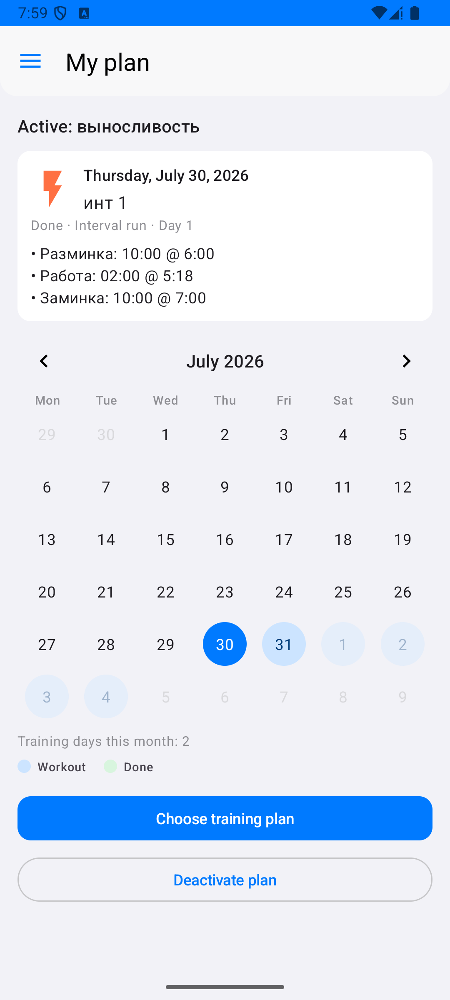

# Runner - Приложение для трекинга беговых тренировок

[🇬🇧 English](README_EN.md) | 🇷🇺 Русский

Android приложение для отслеживания беговых тренировок с GPS-трекингом, картами, статистикой, экспортом и импортом данных.

Package ID: `com.runner.academy`.

## 📸 Скриншоты

<p align="center">
  
  
  
  
</p>

## 📱 Описание

Runner - это полнофункциональное приложение для бегунов, которое позволяет:
- Отслеживать тренировки в реальном времени с помощью GPS
- Просматривать маршрут на интерактивной карте
- Вести **планы тренировок** и базовые интервальные тренировки
- Анализировать статистику тренировок
- Сохранять историю всех тренировок
- Экспортировать и импортировать данные (JSON, GPX, CSV)

## ✨ Основные возможности

### 🏃 Трекинг тренировок
- **GPS-трекинг в реальном времени** с отображением маршрута на карте
- **Индикатор качества GPS** — компактные полоски в полупрозрачном круге (не отвлекают от карты)
- **Автоматическое центрирование карты** на текущем местоположении
- **Кнопка «моя позиция»** — такой же размер, что и GPS-индикатор; появляется при смещении карты
- **Отображение текущего местоположения** с маркером на карте
- **Выбор режима перед стартом**: лёгкий бег → тренировка по плану (если есть активный план на сегодня, выбирается по умолчанию) → список базовых тренировок
- **Цветная шкала интервалов** (разминка / работа / восстановление / заминка) с текущим статусом и прогрессом
- **Голосовое объявление** смены интервала (если включена голосовая обратная связь)
- **Обратный отсчёт** перед стартом (настраивается 3–30 с)
- **Пауза и возобновление** тренировки
- **Длительное удержание** кнопки остановки (3 секунды) для предотвращения случайной остановки

### 📊 Метрики тренировки
- Время тренировки (часы:минуты:секунды)
- Пройденная дистанция (км)
- Средняя скорость (км/ч)
- Текущий и средний темп (мин/км)
- Сожженные калории
- Пульс (уд/мин) — UI-заглушка; интеграция с датчиками планируется

### 🗺️ Карта
- **OpenStreetMap** (Mapnik) в светлой теме; в тёмной — подложка **CARTO Dark Matter**
- Интерактивная карта с жестами масштабирования и прокрутки
- Отображение трека тренировки красной линией; разрывы GPS — пунктиром
- Автоматическая ориентация карты по направлению движения
- Плавная анимация при центрировании

### 📈 Статистика и история
- Просмотр истории всех тренировок
- Детальная информация о каждой тренировке (карта, графики)
- Статистика по типам тренировок
- **Избранные маршруты** — фильтр «Все / Избранное» в списке
- **Редактирование** тренировки и выбор маршрута из уже сохранённых

### ⚙️ Настройки
- Вес, рост, возраст пользователя
- Пол (мужской/женский)
- Система единиц (метрическая/имперская)
- Режим темы (светлая/темная/системная)
- Голосовая обратная связь
- **Обратный отсчёт перед стартом** (3, 5, 10, 15 или 30 секунд)

### 📋 Планы тренировок
- **Мой план** — календарь с активным планом, детали дня и действие «Выбрать план тренировок»
- **Планы тренировок** — создание планов; внутри раздела — **базовые тренировки** (шаблоны с сегментами и иконками интенсивности); JSON импорт/экспорт планов вместе с базовыми
- На экране трекинга: выбор «По плану: …» в списке режимов (без отдельной галочки), цветная шкала отрезков, отметка дня плана как выполненного после сохранения

### 💾 Экспорт и импорт
На экране **«Мои тренировки»** кнопка **+** (speed dial):

**Экспорт**
- **JSON backup** — полный бэкап всех тренировок (включая `trackData`), файл `runner_workouts_backup_*.json`
- **GPX (ZIP)** — архив GPX по тренировкам с треком
- Экспорт одной тренировки в **GPX** с экрана деталей
- Экспорт статистики в **CSV**

**Импорт**
- **JSON backup** — в том числе из старых сборок `com.example.runner` / ветки `export-all-workouts-example` (без `isFavorite`, без `after_gap` в точках)
- **Папка с GPX** — рекурсивный импорт `.gpx` файлов

### 🎨 Интерфейс
- Material 3 с оформлением в духе iOS (system blue, grouped backgrounds, плоские карточки)
- Поддержка тёмной и светлой темы
- Адаптивный дизайн
- Интуитивная навигация через боковое меню

## 🔥 Расчет калорий

Приложение рассчитывает сожженные калории на основе упрощенной формулы, которая учитывает вес пользователя и пройденную дистанцию.

### Формула расчета

```
Калории = Дистанция (км) × Вес (кг)
```

**Примеры:**
- При весе 70 кг и дистанции 5 км: `5 × 70 = 350 ккал`
- При весе 60 кг и дистанции 10 км: `10 × 60 = 600 ккал`
- При весе 80 кг и дистанции 3 км: `3 × 80 = 240 ккал`

### Особенности

- **Учитывается вес пользователя**: Чем больше вес, тем больше калорий сжигается при той же дистанции
- **Пропорциональность дистанции**: Калории прямо пропорциональны пройденному расстоянию
- **Значение по умолчанию**: Если вес не указан в настройках, используется значение 70 кг
- **Обновление в реальном времени**: Калории пересчитываются при каждом обновлении GPS-координат

### Важно

⚠️ **Примечание**: Это упрощенная формула для приблизительной оценки. Реальное количество сожженных калорий зависит от множества факторов:
- Индивидуальный метаболизм
- Скорость бега
- Рельеф местности (подъемы/спуски)
- Погодные условия
- Физическая форма

Для более точных расчетов рекомендуется использовать специализированные фитнес-браслеты или приложения с интеграцией датчиков пульса.

## ⚙️ Логика работы приложения

### Архитектура

Приложение построено на архитектуре **MVVM (Model-View-ViewModel)** с использованием следующих компонентов:

#### 1. **View (UI Layer)**
- `Fragment` - экраны приложения (Tracking, Workouts, Statistics, Settings)
- `Activity` - главная активность с навигацией
- ViewBinding для связи с XML-макетами

#### 2. **ViewModel**
- Управляет бизнес-логикой и состоянием UI
- Использует Kotlin StateFlow для реактивного обновления данных
- Не зависит от Android-компонентов (легко тестируется)

#### 3. **Model (Data Layer)**
- `Room Database` - локальное хранилище тренировок
- `WorkoutDao` - доступ к данным
- `Workout`, `TrackPoint` - модели данных

#### 4. **Service Layer**
- `WorkoutTrackingService` - фоновый сервис для GPS-трекинга
- Работает независимо от UI (продолжает работу при закрытии приложения)
- Использует Foreground Service с уведомлением

### Поток данных при трекинге

```
GPS → LocationCallback → GpsFilter → WorkoutTrackingService
                                    ↓
                            WorkoutSession (StateFlow)
                                    ↓
                            WorkoutTrackingViewModel
                                    ↓
                            Fragment (UI Update)
```

### GPS-трекинг

#### Фильтрация GPS-данных

Приложение использует фильтрацию GPS-координат (пороги мягкие — городской GPS часто шумит):

1. **Валидация координат**
   - Проверка диапазона широты/долготы (-90..90, -180..180)
   - Проверка на NaN и бесконечные значения

2. **Фильтрация по точности**
   - Максимальная приемлемая точность: **150 метров**
   - Точки хуже 150 м отклоняются

3. **Фильтрация выбросов**
   - Максимальный «телепорт» между соседними точками: **800 метров**
   - Расчётная скорость между точками с запасом ×1.75 от лимита типа тренировки
   - Мгновенная скорость из GPS почти не режется (только абсурд ~180+ км/ч)
   - Высота: отсев только при экстремальном скачке (шумный altitude не ломает трек)

4. **Разрывы GPS (gap)**
   - После паузы фикса ~**20 с** следующая точка — якорь без фантомной дистанции (на карте — пунктир)
   - Близкие точки (&lt; 2 м) не сбрасывают таймер разрыва

5. **Временная валидация**
   - Отклонение точек с более ранним временем
   - Ожидаемая дистанция с полом по лимиту скорости тренировки (не обнуляется при `speed = 0`)

#### Обновление местоположения

- **Интервал обновления**: 2 секунды (настраивается)
- **Минимальное расстояние**: 2 метра между точками
- **Адаптивный интервал**: Интервал обновления может изменяться в зависимости от скорости движения

### Состояния тренировки

Приложение управляет четырьмя состояниями тренировки:

1. **NOT_STARTED** - тренировка не запущена
   - Отображается кнопка "Старт"
   - GPS-индикатор показывает статус поиска сигнала

2. **RUNNING** - тренировка активна
   - Отслеживание GPS в реальном времени
   - Обновление метрик каждую секунду
   - Отображение трека на карте
   - Доступны кнопки "Пауза" и "Стоп"

3. **PAUSED** - тренировка на паузе
   - Таймер останавливается
   - GPS-трекинг приостанавливается (точки не добавляются к треку)
   - Время паузы не учитывается в общем времени
   - Доступны кнопки "Возобновить" и "Стоп"

4. **STOPPED** - тренировка остановлена
   - Все данные сохраняются в базу данных
   - Тренировка доступна в истории
   - Можно экспортировать / импортировать (JSON, GPX, CSV)

### Фоновый сервис

`WorkoutTrackingService` обеспечивает непрерывный трекинг:

- **Foreground Service** - работает с постоянным уведомлением
- **Wake Lock** - предотвращает засыпание устройства во время тренировки
- **Автоматическое продление Wake Lock** каждые 9 минут
- **Независимость от UI** - продолжает работу при закрытии приложения
- **Связь с ViewModel** через Binder и callback'и

### Работа с картой

#### Автоматическое центрирование

- Карта автоматически центрируется на текущем местоположении
- Автоцентрирование происходит через 2 секунды после завершения взаимодействия пользователя
- При пользовательском взаимодействии (прокрутка, масштабирование) автоцентрирование отключается
- Кнопка центрирования появляется при смещении карты

#### Ориентация карты

- Карта автоматически поворачивается по направлению движения
- Используется bearing (азимут) из GPS-данных
- Ориентация обновляется при каждом обновлении местоположения

### Сохранение данных

#### Структура данных тренировки

```kotlin
Workout {
    id: Long
    date: Date
    distance: Float (км)
    duration: Long (мс)
    avgPace: Float (мин/км)
    calories: Int?
    notes: String?
    type: WorkoutType
    trackData: String? (JSON с TrackPoint[])
    isFavorite: Boolean
}
```

#### TrackPoint

Каждая точка трека содержит:
- Широта и долгота
- Временная метка
- Точность GPS
- Скорость
- Высота (если доступна)
- Признак разрыва GPS (`after_gap`) — опционально в старых бэкапах
- Источник точки (`source`) — по умолчанию GPS

#### Экспорт и импорт

- **JSON backup** (`formatVersion = 1`): полный снимок тренировок для миграции между установками / пакетами
  - Совместим с экспортом из `com.example.runner` (ветка `feature/export-all-workouts-example`)
  - При импорте legacy-треки без `after_gap`/`source` нормализуются
- **GPX**: стандартный формат для фитнес-приложений (одна тренировка или ZIP всех с треком)
  - Совместим со Strava, Garmin Connect и др.
- **CSV**: статистика / список тренировок для таблиц

## 🛠️ Технологии

- **Язык**: Kotlin
- **Минимальная версия Android**: 8.0 (API 26)
- **Целевая версия Android**: 16 (API 36)
- **Архитектура**: MVVM (Model-View-ViewModel)
- **База данных**: Room Database 2.7 + Room Gradle Plugin, кодоген через **KSP**
- **Карты**: OSMDroid (OpenStreetMap)
- **Локация**: Google Play Services Location API
- **Асинхронность**: Kotlin Coroutines
- **Навигация**: Android Navigation Component
- **UI**: Material Design Components, ViewBinding

## 📦 Зависимости

Основные библиотеки:
- `androidx.room:room-*:2.7.0` - база данных (compiler через KSP)
- `com.google.devtools.ksp` / Kotlin 2.0.21 - аннотации Room
- `org.osmdroid:osmdroid-android:6.1.18` - карты
- `com.google.android.gms:play-services-location:21.0.1` - GPS
- `org.jetbrains.kotlinx:kotlinx-coroutines-android:1.7.3` - корутины
- `com.google.code.gson:gson:2.10.1` - JSON сериализация
- `androidx.documentfile:documentfile` - импорт из папки (SAF)

## 🚀 Установка

### Требования
- Android Studio Hedgehog или новее
- JDK 17 или выше
- Android SDK 26+
- Gradle 9.3+

### Шаги установки

1. Клонируйте репозиторий:
```bash
git clone https://github.com/drrhaos/runner.git
cd runner
```

2. Откройте проект в Android Studio

3. Синхронизируйте Gradle зависимости

4. Подключите Android устройство или запустите эмулятор

5. Запустите приложение (Shift+F10 или кнопка Run)

## 📱 Использование

### Первый запуск
1. При первом запуске приложение запросит разрешения:
   - Доступ к местоположению (обязательно)
   - Разрешение на уведомления (для фонового трекинга)
   - Разрешение на физическую активность (опционально)

2. Заполните настройки профиля:
   - Вес, рост, возраст, пол
   - Это необходимо для расчета калорий

### Начало тренировки
1. Откройте раздел **"Начать тренировку"** из бокового меню
2. Дождитесь GPS-сигнала (компактный индикатор в углу карты)
3. Выберите **режим**: лёгкий бег, тренировку по плану (если есть на сегодня) или базовую тренировку
4. Нажмите кнопку **"Старт"** — начнётся обратный отсчёт
5. После окончания отсчёта тренировка стартует автоматически
6. Во время тренировки вы можете:
   - Просматривать карту с маршрутом (в тёмной теме — тёмная подложка)
   - Следить за шкалой интервалов, если выбран план/базовая тренировка
   - Видеть текущие метрики
   - Развернуть панель для детальной статистики
   - Поставить тренировку на паузу
   - Остановить тренировку (удерживайте кнопку 3 секунды)

### Просмотр тренировок
1. Откройте раздел **"Мои тренировки"**
2. При необходимости отфильтруйте **Избранное**
3. Выберите тренировку для просмотра деталей (карта, графики)
4. С экрана деталей: GPX, шаринг, редактирование, избранное
5. Через **+** на списке: импорт / экспорт всех тренировок (JSON или GPX ZIP)

### Миграция со старого `com.example.runner`
1. В старой сборке экспортируйте JSON backup (или GPX-файлы)
2. Установите `com.runner.academy`
3. **Мои тренировки → + → Импорт** и выберите JSON или папку с GPX

### Настройки
1. Откройте раздел **"Настройки"** из бокового меню
2. Настройте параметры профиля
3. Выберите предпочтения приложения

## 🗂️ Структура проекта

```
app/src/main/
├── java/com/runner/academy/
│   ├── data/                    # Модели данных и Room DAO
│   │   ├── Workout.kt           # Модель тренировки (+ isFavorite)
│   │   ├── TrackPoint.kt        # Точка трека / TrackData
│   │   ├── WorkoutDao.kt        # DAO для работы с БД
│   │   ├── WorkoutRepository.kt
│   │   └── WorkoutDatabase.kt   # База данных Room
│   ├── ui/
│   │   ├── tracking/            # Экран трекинга
│   │   ├── workout/             # Список / детали / добавление / редактирование
│   │   ├── trainingplan/        # Базовые тренировки и планы
│   │   ├── statistics/          # Статистика
│   │   └── settings/            # Настройки
│   ├── service/
│   │   └── WorkoutTrackingService.kt  # Фоновый сервис
│   └── util/                    # Утилиты
│       ├── GpxExporter.kt           # Экспорт GPX (одна тренировка)
│       ├── GpxImporter.kt           # Импорт GPX
│       ├── WorkoutGpxBulkExporter.kt # ZIP всех GPX
│       ├── WorkoutBackupFormat.kt   # JSON backup import/export
│       ├── TrainingPlanBackupFormat.kt # JSON планов и шаблонов
│       ├── TrackDataJson.kt         # Безопасный разбор трека (legacy)
│       ├── CsvExporter.kt           # Экспорт CSV
│       ├── GpsFilter.kt             # Фильтрация GPS точек
│       ├── OsmMapTiles.kt           # Светлая/тёмная подложка карты
│       ├── OsmMapConfig.kt          # User-Agent и кэш OSM
│       └── FormatUtils.kt           # Форматирование данных
├── res/
│   ├── layout/                  # XML макеты
│   ├── drawable/                # Иконки и графические ресурсы
│   ├── values/                  # Строки, цвета, размеры
│   └── navigation/              # Навигационные графы
└── AndroidManifest.xml
```

## 🔧 Разрешения

Приложение требует следующие разрешения:
- `ACCESS_FINE_LOCATION` - точное местоположение для GPS-трекинга
- `ACCESS_COARSE_LOCATION` - приблизительное местоположение
- `ACCESS_BACKGROUND_LOCATION` - фоновое местоположение
- `POST_NOTIFICATIONS` - уведомления о тренировке
- `ACTIVITY_RECOGNITION` - распознавание физической активности
- `FOREGROUND_SERVICE` - фоновый сервис трекинга
- `INTERNET` - загрузка карт OpenStreetMap

## 🧪 Тестирование

Проект включает unit-тесты и инструментальные тесты:
- Unit-тесты для ViewModel и утилит
- Инструментальные тесты для UI компонентов
- Покрытие кода отслеживается через JaCoCo

Запуск тестов:
```bash
./gradlew test              # Unit-тесты
./gradlew connectedAndroidTest  # Инструментальные тесты
./gradlew jacocoTestReport   # Отчет о покрытии
```

## 📄 Лицензия

Проект распространяется под лицензией [MIT](LICENSE).

Дополнительно см. [Политику конфиденциальности](PRIVACY.md) и [руководство для контрибьюторов](CONTRIBUTING.md).

## 👥 Авторы

- [DrHaos](https://github.com/drrhaos)
- [john-krasinski](https://github.com/john-krasinski)

## 🤝 Вклад в проект

Вклад в проект приветствуется! Подробности — в [CONTRIBUTING.md](CONTRIBUTING.md).

Кратко:
1. Создайте форк проекта
2. Создайте ветку для новой функции (`git checkout -b feature/AmazingFeature`)
3. Зафиксируйте изменения (`git commit -m 'Add some AmazingFeature'`)
4. Отправьте в ветку (`git push origin feature/AmazingFeature`)
5. Откройте Pull Request

## 📝 Changelog

Полная история версий (по git-тегам): [CHANGELOG.md](CHANGELOG.md) · [English](CHANGELOG_EN.md).

Актуальный релиз: **`v.0.0.7`**.

## 🐛 Известные проблемы

- Пульс отображается как заглушка (`--`) — нет интеграции с BLE/Health Connect
- При смене `applicationId` (`com.example.runner` / `com.drrhaos.runner` → `com.runner.academy`) данные не переносятся автоматически — используйте **экспорт JSON/GPX** в старой сборке и **импорт** в новой

## 🔮 Планы на будущее

- [ ] Интеграция с фитнес-браслетами
- [ ] Социальные функции (делиться тренировками)
- [x] Планы тренировок и базовые интервальные шаблоны
- [x] Анализ прогресса с графиками
- [x] Голосовые подсказки во время тренировки
- [x] Импорт тренировок (JSON backup, GPX)
- [ ] Импорт TCX / FIT

## 📞 Поддержка

Если у вас возникли вопросы или проблемы, создайте issue в репозитории проекта.

---

**Приятных тренировок! 🏃‍♂️💨**

